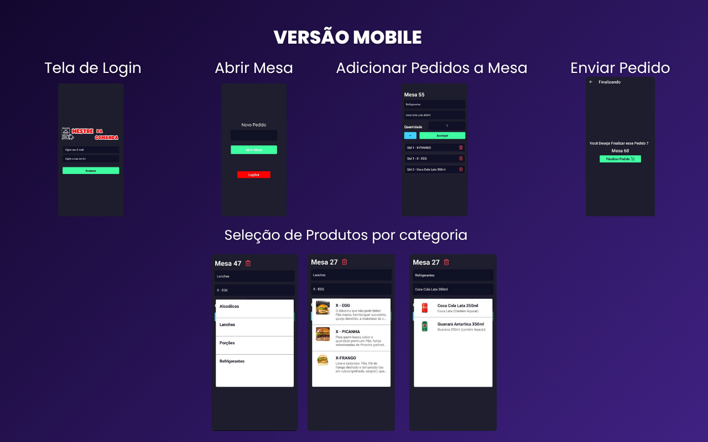

# 🍽️ Mestre da Comanda
## Sistema de Controle de Comandas
## 🚀 Tecnologias Utilizadas

<p align="center">
  <a href="https://reactjs.org/"></a>
  <a href="https://nextjs.org/"></a>
  <a href="https://www.typescriptlang.org/"></a>
  <a href="https://nodejs.org/"></a>
  <a href="https://www.postgresql.org/"></a>
  <a href="https://reactnative.dev/"></a>
</p>

Um sistema completo de **controle de comandas para restaurantes**, desenvolvido com foco em performance, escalabilidade e usabilidade — disponível em **versão Web e Mobile**.


## 🖼️ Telas do Sistema


---
### 💻 Web


---
### 📱 Mobile

---

## Diagrama de Arquitetura do Sistema: A Fazer


---

## 💡 Sobre o Projeto

O **Mestre da Comanda** foi criado para facilitar o gerenciamento de pedidos em restaurantes, permitindo controlar mesas, produtos e comandas de forma rápida e integrada entre o sistema Web e o aplicativo Mobile.

O sistema permite que garçons e administradores controlem todo o fluxo de pedidos — desde a abertura de uma mesa até a conclusão do pedido.

---

## 🚀 Acesse a Aplicação em Produção
<a href="https://mestre-da-comanda-saas-2qod.vercel.app/">Clique aqui para Abrir o software em nova aba</a>

---

## 🧾 Funcionalidades Principais

### 🖥️ **Versão Web**
- Cadastro de novos usuários  
- Login e autenticação segura  
- Proteção de rotas privadas  
- Exibição dos dados do usuário logado  
- Criação e listagem de categorias  
- Criação e listagem de produtos por categoria  
- Abertura de uma nova **mesa (order)**  
- Adição e remoção de itens da mesa  
- Envio de pedidos (tirar do rascunho)  
- Listagem de pedidos ativos (não em “draft”)  
- Visualização dos detalhes completos de cada mesa  
- Conclusão do pedido  

### 📱 **Versão Mobile**
- Abertura de mesas  
- Seleção de categorias e produtos  
- Escolha de quantidade e envio de pedidos para o sistema Web  

---

## 🧩 Integração Web + Mobile

Os pedidos criados no **app mobile** são sincronizados em tempo real com o **painel web**, permitindo que a cozinha e o caixa acompanhem o andamento de cada comanda.

---


---

## 🧠 Aprendizados e Objetivos

Esse projeto foi desenvolvido com o objetivo de consolidar conhecimentos **Fullstack** utilizando o ecossistema **TypeScript + Prisma + PostgreSQL + React/Next + Express + NodeJs**, explorando conceitos de:
- Autenticação JWT e Context API
- Consumo de APIs REST
- Integração em tempo real Web ↔ Mobile

---
## 💡 Próximos Passos
- Fazer Deploy na Vercel Backend + Fontend na vercel
- Migrando Migration das Tabelas do Banco de de Dados no Neon

---
## ⚙️ Como Executar o Projeto

### 🖥️ Web
```bash
# Clone o repositório
git clone https://github.com/seuusuario/mestre-da-comanda.git

# Acesse a pasta do projeto
cd mestre-da-comanda/web

# Instale as dependências
yarn install

# Execute o servidor de desenvolvimento
yarn dev

## ⚙️ Futuras Atualizações
- Criar um Cardápio Digital para os Clientes 
